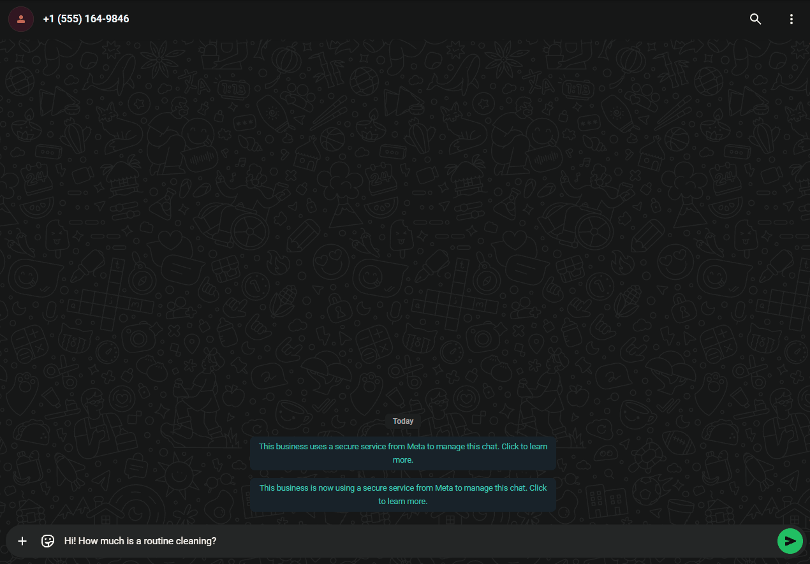
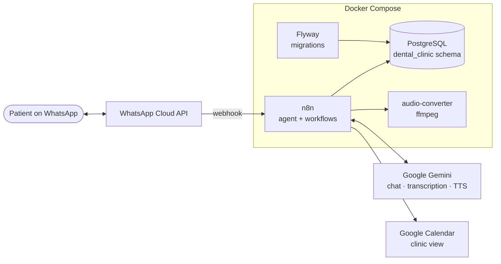

# WhatsApp AI Receptionist

An AI receptionist that answers patients on WhatsApp for a (fictional) dental clinic: it answers questions,
books, checks, reschedules and cancels appointments, understands voice notes and can reply with voice.

Built with **n8n**, **Google Gemini**, **PostgreSQL** and the **WhatsApp Cloud API**, packaged with Docker Compose.

> **Demo clinic.** Maple Grove Dental Studio (New York) is fictional; its services, prices and address are made up.
> The project runs on a single machine with a Meta test number. It is a portfolio project, not a production deployment.

<p align="center">
  
</p>

*A patient asks for the price, requests a Monday morning slot, picks one of the real free times, confirms the
summary and gets a booking code — all saved in PostgreSQL and mirrored to Google Calendar.*

## What it does

- **Natural conversation in the patient's language** (English, Spanish, …) with memory per WhatsApp number.
- **Real availability**: free slots come from the database and depend on each service's duration
  (a 90-minute root canal needs three free 30-minute blocks).
- **Booking with confirmation**: the agent summarizes service, date and time and only books after a clear "yes".
  Each appointment gets a booking code (e.g. `MG-7K3QX`).
- **Check, reschedule and cancel**: patients can only touch their own appointments
  (same WhatsApp number, or booking code + full name from another number).
- **Voice notes in and out**: audio is transcribed with Gemini; if the patient sent audio, the reply is a voice note
  (plus a text message when it contains a booking code, so it can be copied).
- **Messages sent in a row are answered once**: an 8-second buffer merges "hi" / "I need a cleaning" / "on Monday".
- **Google Calendar mirror**: the clinic sees every appointment in its calendar; if Google fails, a sync job repairs it.
- **Retention policies**: chat history is deleted after 90 days.

## Architecture



**Message flow** (workflow `WhatsApp AI Receptionist`):

1. Meta calls the webhook; n8n answers `200` immediately and marks the message as read with a typing indicator.
2. Voice notes are downloaded and transcribed; text and audio continue the same way.
3. The message is buffered for 8 seconds; only the execution of the latest message continues, with all texts merged.
4. The **AI Agent** (Gemini + Postgres chat memory) replies, calling these tools when needed:

   | Tool | Sub-workflow | Database function |
   |---|---|---|
   | `check_availability` | Tool: Check availability | `get_available_slots` |
   | `book_appointment` | Tool: Book appointment | `book_appointment` |
   | `get_my_appointments` | Tool: Get my appointments | `get_my_appointments` |
   | `cancel_appointment` | Tool: Cancel appointment | `cancel_appointment` |
   | `reschedule_appointment` | Tool: Reschedule appointment | `reschedule_appointment` |

5. The reply goes back as text, or as a voice note (Gemini TTS → `audio-converter` → WhatsApp).

Background workflows: **Sync appointments to Google Calendar** (every 15 min) and **Daily maintenance** (3 AM).

## Design decisions

- **The database is the source of truth; the calendar is a mirror.** Booking is one atomic database operation.
  Google Calendar is updated afterwards, and a `calendar_synced` flag lets the sync job create, move or delete
  events that failed (eventual consistency). A Google outage never loses an appointment.
- **Double booking is impossible at the database level**: an `EXCLUDE USING gist` constraint rejects overlapping
  confirmed appointments, even if two requests arrive in the same millisecond.
- **Code does the math, the LLM does the talking.** Free slots, opening hours and durations are computed in SQL;
  the model only converses and calls tools. All business rules live in PL/pgSQL functions that return
  `{ok, message}` instead of raising errors, so the agent can explain what went wrong.
- **Ownership checks** never reveal whether another person's booking code exists.
- **Soft delete**: cancelled appointments keep their row and full history (`appointment_history`).
- **Idempotency**: the message buffer has a unique `message_id`, so a webhook Meta delivers twice is answered once.
- **LLM-agnostic**: the model is one node; swapping Gemini for Claude or GPT does not touch tools or data.

## Tech stack

| Piece | Technology |
|---|---|
| Orchestration and agent | n8n 2.40 (AI Agent node, sub-workflows as tools) |
| LLM, transcription, TTS | Google Gemini (`gemini-flash-lite-latest`, `gemini-2.5-flash-preview-tts`) |
| Database | PostgreSQL 16 + pgvector, PL/pgSQL functions |
| Migrations | Flyway (versioned `V__` + repeatable `R__`) |
| Messaging | WhatsApp Cloud API (Meta Graph API) |
| Audio | Python + ffmpeg microservice (PCM → OGG/Opus) |
| Infrastructure | Docker Compose, optional ngrok tunnel |

## Repository layout

```
├── docker-compose.yml
├── .env.example
├── database/
│   ├── migrations/      V1 schema · V2 demo clinic data · V3 chat history · V4 message buffer
│   ├── functions/       R__ repeatable migrations: booking, appointment management, cleanup
│   └── tests/           booking_tests.sql
├── n8n/
│   ├── workflows/       the agent and its tools, exported as JSON
│   └── scripts/         helpers used by setup-n8n.sh and export-workflows.sh
├── scripts/
│   ├── setup-n8n.sh         credentials + workflows + publishing on a fresh n8n
│   └── export-workflows.sh  n8n → repository, without personal data
├── postgres/Dockerfile  PostgreSQL + pgvector
└── audio-converter/     PCM → OGG/Opus service
```

## Getting started

### Prerequisites

- Docker with Docker Compose.
- A [Meta for Developers](https://developers.facebook.com/) app with the WhatsApp product (the free test number works).
- A [Google AI Studio](https://aistudio.google.com/) API key (Gemini).
- A Google Cloud OAuth client with the Google Calendar API enabled, and a calendar for the clinic.
- A public HTTPS URL for the webhook (e.g. an ngrok static domain).

### 1. Configure

```bash
cp .env.example .env        # fill in every value (each one is explained in the file)
```

### 2. Start and set up

```bash
docker compose up -d        # PostgreSQL + Flyway migrations, audio-converter and n8n
./scripts/setup-n8n.sh      # credentials, workflows and publishing
```

`setup-n8n.sh` takes an empty n8n to a working agent:

1. Creates the four credentials from `.env`, with the ids the workflows reference, so every node is already linked.
2. Imports the nine workflows from `n8n/workflows/` (ids preserved, calendar id filled from `GOOGLE_CALENDAR_ID`).
3. Publishes them (tools first, then the agent and the scheduled workflows) and restarts n8n.

| Credential | Used for | From `.env` |
|---|---|---|
| Postgres account | tools, chat memory, message buffer | `POSTGRES_*` (host `postgres`) |
| WhatsApp account | sending messages, downloading audio | `WHATSAPP_ACCESS_TOKEN`, `WHATSAPP_BUSINESS_ACCOUNT_ID` |
| Google Gemini (PaLM) Api account | chat model, transcription, TTS | `GEMINI_API_KEY` |
| Google Calendar account | calendar mirror | `GOOGLE_OAUTH_CLIENT_ID`, `GOOGLE_OAUTH_CLIENT_SECRET` |

### 3. The two manual steps

- Open n8n at `http://localhost:5678` (or your domain), create the owner account, open **Credentials →
  Google Calendar account** and click **Sign in with Google** (Google requires a person to grant access).
- Connect WhatsApp (below).

### 4. Connect WhatsApp

In the Meta app: **WhatsApp → Configuration → Webhook**

- Callback URL: `https://<your-public-domain>/webhook/whatsapp`
- Subscribe to the `messages` field.
- Add your phone to the test recipients list and send the test number a message.

## Deploying to a server

The same two commands work on any Linux server with Docker. On top of that:

- **HTTPS**: put a reverse proxy (Caddy, Traefik or nginx) in front of n8n on port 5678, or use the `tunnel`
  profile (`docker compose --profile tunnel up -d`) with an ngrok static domain. Set `N8N_WEBHOOK_URL` to the
  public URL.
- **Do not publish PostgreSQL**: it is bound to `127.0.0.1` on purpose; reach it through an SSH tunnel.
- **Keep `N8N_ENCRYPTION_KEY` safe**: n8n encrypts stored credentials with it. Losing it means re-creating them
  (`./scripts/setup-n8n.sh` can do that from `.env`).
- **Backups**: `pg_dump` of the database plus the `n8n_data` volume. The workflows themselves are in this repository.
- **WhatsApp token**: use a System User token (does not expire) instead of the 24-hour token from API Setup.
- **Google OAuth app**: in testing mode Google expires the calendar grant every 7 days; publish the OAuth app
  (or use a Google Workspace internal app) for a real deployment.

Verified by bringing the whole stack up on empty volumes, running `setup-n8n.sh` and checking that all nine
workflows were active, the webhook answered Meta's verification and every node had its credential.

## Database

Flyway runs on every `docker compose up`:

- `database/migrations/V<n>__*.sql` run once, in order. **Never edit an applied one**: add `V<n+1>__…`.
- `database/functions/R__*.sql` are re-applied whenever their content changes (`CREATE OR REPLACE`).
- Every function pins `SET search_path = dental_clinic`, because n8n connects with the default schema.

### Tests

```bash
docker compose exec -T postgres sh -c 'psql -U "$POSTGRES_USER" -d "$POSTGRES_DB" -v ON_ERROR_STOP=1' < database/tests/booking_tests.sql
```

They run inside a transaction that is rolled back and print `ALL TESTS PASSED`. Covered: closed days, booking code
format, overlap rejection, duration-aware availability, opening hours, unknown services, past dates, the 30-minute
grid, ownership, rescheduling, double cancellation and history.

## Working on the workflows

Edit in the n8n UI, then export so the repository stays the source of truth:

```bash
./scripts/export-workflows.sh
```

The export removes instance data (owner email, versions, timestamps) and replaces the calendar id with a placeholder.

## Privacy

- Conversations are stored for the agent's memory and **deleted after 90 days** (`Daily maintenance`).
- Voice notes are transcribed and never stored; only the text remains.
- The bot never diagnoses or recommends medication; emergencies are sent to the clinic's phone.
- Gemini's free tier may use prompts to improve Google's models: use it only with test data.
  A real clinic needs a paid plan (and, in the US, a HIPAA review before handling patient data).

## Known limitations and next steps

- Webhook requests are not yet verified with Meta's `X-Hub-Signature-256`, and the verification endpoint does not
  check the verify token.
- Single chair: overlapping appointments are not allowed at all (multiple dentists would add a `dentist_id`).
- Gemini TTS on the free tier takes 40–70 s per voice reply.
- Next: appointment reminders (they need an approved WhatsApp message template), RAG over clinic documents with
  pgvector (aftercare instructions, insurance policies), conversation evaluations, and handoff to a human.
